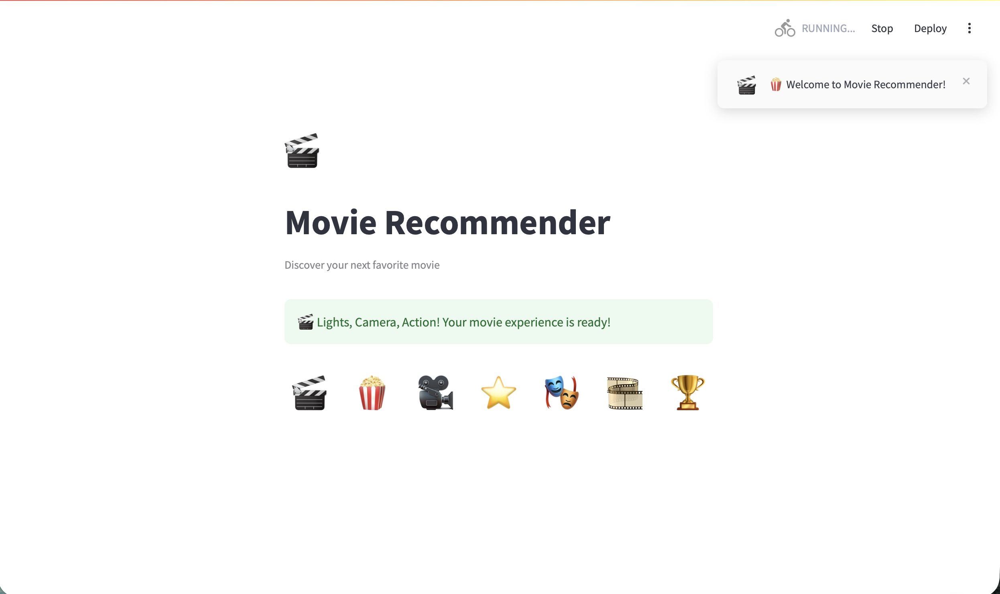
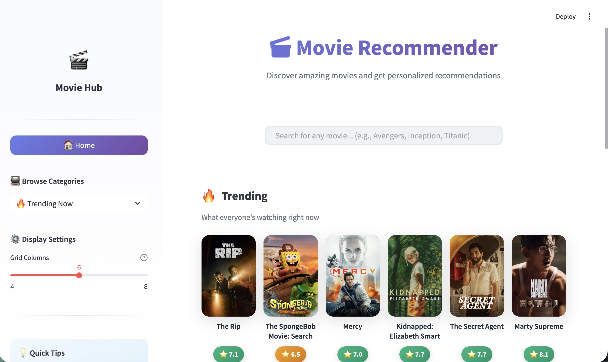
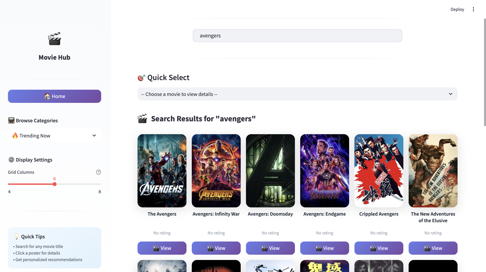

# 🎬 Movie Recommender System

A full-stack movie recommendation application that leverages **Natural Language Processing (NLP)** and **Machine Learning** to deliver personalized movie suggestions. Powered by the TMDB API with a modern, responsive user interface.


---

## 📌 Overview

This project implements a **content-based recommendation system** that analyzes movie metadata to suggest similar films. The system combines TF-IDF vectorization with cosine similarity to find movies with similar themes, plots, and characteristics.

### Key Highlights

- 🎯 **Smart Recommendations** — ML-powered suggestions based on movie content analysis
- 🔍 **Real-time Search** — Instant movie search with autocomplete functionality  
- 📊 **Hybrid Approach** — Combines content-based filtering with genre-based discovery
- 🚀 **Production Ready** — Deployed backend API with optimized performance
- 🎨 **Modern UI** — Sleek, responsive interface with smooth animations

---

##  Features

| Feature | Description |
|---------|-------------|
| **Movie Search** | Search and enrich movie data using TMDB’s API for metadata, images, and discovery endpoints|
| **Content-Based Recommendations** | Get similar movies based on plot, themes, and keywords |
| **Genre Discovery** | Explore movies by genre with curated collections |
| **Category Browsing** | Browse Trending, Popular, Top Rated, Now Playing & Upcoming |
| **Detailed Movie Info** | View ratings, runtime, cast, posters, and backdrops |
| **Responsive Design** | Optimized for desktop and tablet viewing |

---

##  Technical Architecture

### Recommendation Engine

The system employs a **hybrid recommendation approach**:

**1. Content-Based Filtering (TF-IDF + Cosine Similarity)**
- Processes movie metadata including overviews, genres, and keywords
- Transforms text data into TF-IDF vectors capturing term importance
- Computes pairwise cosine similarity to identify related movies
- Pre-computed similarity matrices stored as pickle files for fast inference

**2. Genre-Based Filtering**
- Leverages TMDB's discover API for genre-specific recommendations
- Ensures diversity in suggestions beyond content similarity

### System Architecture

```
┌─────────────────┐     ┌─────────────────┐     ┌─────────────────┐
│   Streamlit     │────▶│    FastAPI      │────▶│    TMDB API     │
│   Frontend      │◀────│    Backend      │◀────│                 │
└─────────────────┘     └────────┬────────┘     └─────────────────┘
                                 │
                        ┌────────▼────────┐
                        │  ML Models      │
                        │  (Pickle Files) │
                        └─────────────────┘
```

---

##  Tech Stack

### Backend
| Technology | Purpose |
|------------|---------|
| FastAPI | High-performance async REST API |
| httpx | Async HTTP client for external API calls |
| pandas | Data manipulation and preprocessing |
| scikit-learn | TF-IDF vectorization and similarity computation |
| NumPy / SciPy | Numerical operations and sparse matrices |

### Frontend
| Technology | Purpose |
|------------|---------|
| Streamlit | Interactive web application framework |
| Custom CSS | Modern UI with gradients and animations |

### External Services
| Service | Purpose |
|---------|---------|
| TMDB API | Movie metadata, images, and real-time data |
| Render | Backend API hosting |

---

##  Project Structure

```
MovieRecommendation/
│
├── main.py                 # FastAPI backend application
├── app.py                  # Streamlit frontend application
├── requirements.txt        # Python dependencies
├── README.md               # Documentation
│
├── df.pkl                  # Processed movie DataFrame
├── indices.pkl             # Title-to-index mapping
├── tfidf_matrix.pkl        # Pre-computed TF-IDF matrix
└── tfidf.pkl               # Fitted TF-IDF vectorizer
```

---

##  Getting Started

### Prerequisites

- Python 3.9 or higher
- TMDB API Key — [Get yours here](https://www.themoviedb.org/settings/api)

### Installation

1. **Clone the repository**
   ```bash
   git clone https://github.com/yourusername/MovieRecommendation.git
   cd MovieRecommendation
   ```

2. **Set up virtual environment**
   ```bash
   python -m venv .venv
   source .venv/bin/activate        # macOS/Linux
   .venv\Scripts\activate           # Windows
   ```

3. **Install dependencies**
   ```bash
   pip install -r requirements.txt
   ```

4. **Configure API Key**
   
   Set your TMDB API key as an environment variable:
   ```bash
   export TMDB_API_KEY=your_api_key_here
   ```

### Running the Application

**Start Backend Server**
```bash
uvicorn main:app --reload --port 8000
```

**Start Frontend (new terminal)**
```bash
streamlit run app.py
```

Access the application at `http://localhost:8501`

---

## 📡 API Reference

### Endpoints

| Method | Endpoint | Description |
|--------|----------|-------------|
| `GET` | `/health` | Health check |
| `GET` | `/home` | Fetch movies by category |
| `GET` | `/tmdb/search` | Search movies |
| `GET` | `/movie/id/{id}` | Get movie details |
| `GET` | `/recommend/tfidf` | TF-IDF recommendations |
| `GET` | `/recommend/genre` | Genre-based recommendations |
| `GET` | `/movie/search` | Combined recommendation bundle |

### Query Parameters

| Endpoint | Parameter | Type | Description |
|----------|-----------|------|-------------|
| `/home` | `category` | string | trending, popular, top_rated, now_playing, upcoming |
| `/home` | `limit` | int | Number of results (default: 20) |
| `/tmdb/search` | `query` | string | Search term |
| `/recommend/tfidf` | `title` | string | Movie title for recommendations |
| `/recommend/tfidf` | `top_n` | int | Number of recommendations |

---

## 🎓 Machine Learning Approach

### Model Training Pipeline

1. **Data Collection** — Aggregated movie metadata from TMDB
2. **Preprocessing** — Combined overview, genres, and keywords into feature text
3. **Vectorization** — Applied TF-IDF with English stop words removal
4. **Similarity Computation** — Calculated cosine similarity between all movie pairs
5. **Serialization** — Exported trained models as pickle files for production use

### Model Artifacts

| File | Description | Size |
|------|-------------|------|
| `df.pkl` | Processed movie DataFrame with metadata | ~15 MB |
| `tfidf_matrix.pkl` | Sparse TF-IDF feature matrix | ~50 MB |
| `indices.pkl` | Title-to-index lookup dictionary | ~1 MB |
| `tfidf.pkl` | Fitted TF-IDF vectorizer object | ~2 MB |

---

## 🌐 Deployment

### Frontend (Streamlit Cloud)
Deploy to Streamlit Cloud by connecting your GitHub repository.

---

## �️ Screenshots

### Loading Screen
*Welcome animation with progress indicators*

<p align="center">
  
</p>

---

### Home Page
*Browse trending, popular, and top-rated movies with an intuitive interface*

<p align="center">
  
</p>

---

### Search Results
*Instant search with autocomplete suggestions and movie grid*

<p align="center">
  
</p>

---

## �📄 License

This project is licensed under the MIT License.

---

---

<div align="center">

**Built with ❤️ using FastAPI, Streamlit & Machine Learning**

[Report Bug](https://github.com/yourusername/MovieRecommendation/issues) · [Request Feature](https://github.com/yourusername/MovieRecommendation/issues)

</div>
